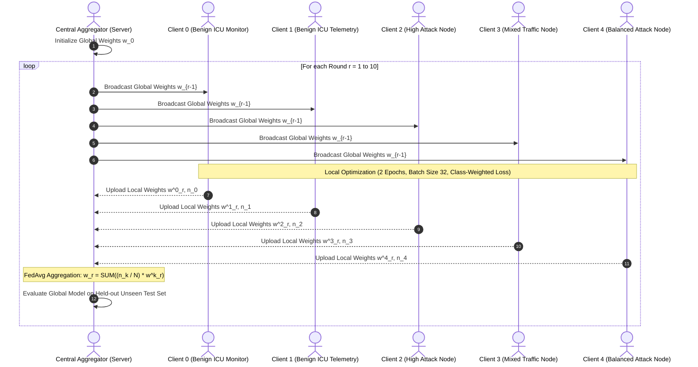

# 🏥 FLONHEALTH: Privacy-Preserving Federated Learning on Healthcare & ICU IoMT Datasets

[](https://www.python.org/)
[](https://tensorflow.org/)
[](https://scikit-learn.org/)
[-success.svg)](https://arxiv.org/abs/1602.05629)
[](https://en.wikipedia.org/wiki/Internet_of_medical_things)
[](LICENSE)

An end-to-end **Federated Learning (FL)** framework designed for decentralized intrusion detection across **Intensive Care Unit (ICU)** and **Internet of Medical Things (IoMT)** networks. 

By leveraging **Federated Averaging (`FedAvg`)**, **FLONHEALTH** trains a high-precision deep intrusion detection model across distributed medical nodes **without transferring raw patient telemetry or hospital network traffic to a centralized server**, ensuring strict compliance with healthcare privacy regulations (e.g., HIPAA, GDPR).

---

## 📌 Table of Contents

- [Overview & Motivation](#-overview--motivation)
- [Key Features](#-key-features)
- [System Architecture](#-system-architecture)
- [Dataset & Data Preprocessing](#-dataset--data-preprocessing)
  - [Dataset Overview](#dataset-overview)
  - [Data Pipeline & Leakage Prevention](#data-pipeline--leakage-prevention)
  - [Non-IID Client Partitioning](#non-iid-client-partitioning)
- [Model Architecture & Training Setup](#-model-architecture--training-setup)
- [Experimental Results](#-experimental-results)
  - [Global Aggregation Performance](#global-aggregation-performance)
  - [Per-Client Final Evaluation](#per-client-final-evaluation)
  - [Key Insights & Convergence](#key-insights--convergence)
- [Feature Importance Analysis](#-feature-importance-analysis)
- [Repository Structure](#-repository-structure)
- [Getting Started](#-getting-started)
  - [Prerequisites](#prerequisites)
  - [Running on Google Colab](#running-on-google-colab)
  - [Running Locally](#running-locally)
- [Future Enhancements](#-future-enhancements)
- [License](#-license)

---

## 📖 Overview & Motivation

Modern hospitals rely heavily on interconnected **Internet of Medical Things (IoMT)** devices, including patient vital signs monitors, infusion pumps, ventilators, and smart ICU environment controllers communicating via protocols like **MQTT** and **TCP/IP**.

### The Challenge
- **High Vulnerability**: Medical IoT networks are prime targets for cyberattacks (e.g., DDoS, unauthorized access, reconnaissance, payload manipulation), which can compromise patient safety and clinical operations.
- **Privacy Barriers**: Strict medical data governance (HIPAA, GDPR) prevents hospitals from centralizing raw network and patient telemetry data for conventional machine learning.
- **Data Heterogeneity (Non-IID)**: Real hospital nodes experience vastly different traffic volumes and threat exposures—some departments see zero attacks while others face heavy assault.

### The Solution: FLONHEALTH
FLONHEALTH formulates decentralized cybersecurity using **Federated Averaging (`FedAvg`)**:
- Each ICU sub-network / edge device trains locally on its private traffic data.
- Only local model parameter weights ($\mathbf{w}_k$) are sent to the central orchestrator.
- The global server aggregates weights weighted by local sample sizes ($n_k$) and redistributes an updated global defense model.

---

## ✨ Key Features

- **Privacy-Preserving Collaborative Defense**: Zero raw patient telemetry or raw packet payload leaves local boundaries.
- **Realistic Non-IID Partitioning**: Simulates 5 heterogeneous hospital clients segmented by source IP addresses (`ip.src`), reflecting natural real-world variations in attack distribution (from 0% to 66% attack ratio).
- **Leakage-Free Preprocessing**: Stratified train/test splitting before any scaling or encoding, with unseen class resilience (`'UNKNOWN'` class mapping) in test splits.
- **Balanced Local Optimization**: Dynamic class-weight adjustment (`compute_class_weight`) on local nodes to counteract local class imbalances.
- **Production-Grade Detection Accuracy**: Achieves **>99.8% Accuracy**, **>0.998 F1-Score**, and **>0.999 ROC-AUC** within only 3 communication rounds.

---

## 🏗 System Architecture



---

## 📊 Dataset & Data Preprocessing

### Dataset Overview
The project processes packet telemetry collected from an active ICU network testbed:
- **`Attack.csv`**: Malicious traffic captures (DoS, MQTT floods, port scans, abnormal message flags).
- **`environmentMonitoring.csv`**: Benign ICU environmental monitoring sensors (temperature, humidity, air quality).
- **`patientMonitoring.csv`**: Benign bedside medical equipment vital sign telemetry.
- **Total Records**: **188,694 packets** across **52 initial network attributes**.

### Data Pipeline & Leakage Prevention
1. **Redundancy & Identifier Removal**:
   - Dropped duplicate/constant/redundant columns: `['tcp.connection.fin', 'tcp.connection.rst', 'frame.len', 'tcp.pdu.size', 'mqtt.conflags', 'class']`.
   - Separated client routing keys (`ip.src`, `ip.dst`) from feature inputs.
2. **Missing & Infinite Value Handling**:
   - Replaced `np.inf` / `-np.inf` with `NaN` and purged null records.
3. **Strict Stratified Split**:
   - Split 80% Train / 20% Test stratified by the binary target `label` (0 = Benign, 1 = Attack) **prior** to any data transformations to guarantee zero data leakage.
4. **Encoding & Scaling**:
   - Categorical columns encoded via `LabelEncoder` fitted strictly on training data with dynamic `'UNKNOWN'` label support for out-of-vocabulary test entries.
   - Numerical and encoded features scaled via `StandardScaler` fitted strictly on train data and transformed onto test data.

### Non-IID Client Partitioning
Data is partitioned across **5 distributed clients** based on unique source IP address clusters (`ip.src`), mimicking real ICU subnetworks:

| Client ID | Role / Subnetwork Profile | Sample Count ($n_k$) | Attack Ratio |
| :--- | :--- | :---: | :---: |
| **Client 0** | Benign Vital Monitoring Hub | 8,063 | **0.00%** (Clean) |
| **Client 1** | Benign Environment Sensor Hub | 26,851 | **0.00%** (Clean) |
| **Client 2** | Targeted ICU Gateway | 61,915 | **66.00%** (Heavy Attack) |
| **Client 3** | General ICU Workstation | 15,783 | **21.00%** (Intermittent Attack) |
| **Client 4** | Mixed Telemetry Controller | 38,343 | **51.00%** (Balanced) |

---

## 🧠 Model Architecture & Training Setup

### Deep Neural Network (DNN)
A multi-layer perceptron with dropout and batch normalization to prevent overfitting under Non-IID distributions:

```
Input Layer (Input Dim: ~43 Scaled Features)
    │
    ▼
Dense (64 units, ReLU) ──► BatchNormalization ──► Dropout (p = 0.3)
    │
    ▼
Dense (32 units, ReLU) ──► BatchNormalization ──► Dropout (p = 0.2)
    │
    ▼
Dense (2 units, Softmax) ──► Output Probabilities [Benign, Attack]
```

### Federated Hyperparameters
- **Federated Algorithm**: Federated Averaging (`FedAvg`)
- **Global Communication Rounds**: `10`
- **Local Epochs per Round**: `2`
- **Batch Size**: `32`
- **Optimizer**: `Adam(learning_rate=0.0005, clipnorm=1.0)`
- **Loss Function**: `sparse_categorical_crossentropy`
- **Class Balancing**: Dynamic `compute_class_weight('balanced')` applied locally per client.

---

## 📈 Experimental Results

### Global Aggregation Performance

The global model was evaluated at every round on the hold-out test set ($N_{\text{test}} \approx 37,739$ samples):

| Round | Accuracy | Precision | Recall | F1-Score | ROC-AUC | Log Loss |
| :---: | :---: | :---: | :---: | :---: | :---: | :---: |
| **Round 1** | 99.19% | 0.9852 | 0.9959 | 0.9905 | 0.9986 | 0.0440 |
| **Round 2** | 99.83% | 0.9968 | 0.9991 | 0.9980 | 0.9989 | 0.0176 |
| **Round 3** | **99.86%** | **0.9972** | **0.9995** | **0.9983** | **0.9991** | **0.0153** |
| **Round 4** | 99.84% | 0.9968 | 0.9994 | 0.9981 | **0.9998** | 0.0147 |
| **Round 5** | 99.72% | 0.9945 | 0.9992 | 0.9968 | **0.9998** | 0.0169 |
| **Round 6** | 99.82% | 0.9965 | 0.9993 | 0.9979 | 0.9996 | 0.0138 |
| **Round 7** | 99.83% | 0.9968 | 0.9993 | 0.9980 | 0.9993 | 0.0157 |
| **Round 8** | 99.83% | 0.9968 | 0.9993 | 0.9980 | 0.9993 | **0.0137** |
| **Round 9** | 99.75% | 0.9952 | 0.9991 | 0.9971 | 0.9993 | 0.0145 |
| **Round 10**| 99.71% | 0.9942 | 0.9990 | 0.9966 | 0.9993 | 0.0166 |

### Per-Client Final Evaluation

Final model parameters evaluated on the test set individually:

| Client ID | Local Attack Ratio | Accuracy | Precision | Recall | F1-Score | ROC-AUC | Loss |
| :---: | :---: | :---: | :---: | :---: | :---: | :---: | :---: |
| **Client 0** | 0.00 (Zero attack locally) | 97.13% | 93.67% | **100.00%** | 96.73% | 0.9990 | 0.0697 |
| **Client 1** | 0.00 (Zero attack locally) | 92.81% | 85.52% | **99.99%** | 92.19% | 0.9963 | 0.6787 |
| **Client 2** | 0.66 (High attack locally) | 99.54% | 98.93% | **100.00%** | 99.46% | 0.9993 | 0.0272 |
| **Client 3** | 0.21 (Mixed traffic)       | 97.40% | 94.23% | **100.00%** | 97.03% | 0.9994 | 0.0753 |
| **Client 4** | 0.51 (Balanced traffic)    | **99.83%** | **99.68%** | **99.91%** | **99.80%** | **0.9992** | **0.0123** |

### Key Insights & Convergence
1. **Rapid Convergence**: The global model achieved **>99.8% F1-score within Round 2–3**, confirming high efficiency of FedAvg even on complex packet header distributions.
2. **Zero-Day Transferability (Clients 0 & 1)**: Even though Clients 0 and 1 had **0% attack samples** in their local training partitions, their models achieved **>99.9% recall on attacks** thanks to the federated global aggregation.
3. **Zero Compromise on Patient Privacy**: The entire collaborative learning loop was completed strictly using local weights and gradients.

---

## 🔍 Feature Importance Analysis

Feature importance analysis conducted via **Random Forest Classifier** ($n=100$ trees) highlighted the most discriminative network attributes for detecting IoMT intrusions:

| Rank | Feature Name | Protocol Layer | Importance Score | Description |
| :---: | :--- | :--- | :---: | :--- |
| 1 | `frame.time_relative` | Frame / Timing | **0.2158** | Elapsed time relative to start of capture |
| 2 | `tcp.hdr_len` | Transport (TCP) | **0.1476** | Length of TCP header |
| 3 | `tcp.window_size_value` | Transport (TCP) | **0.1150** | Flow control window buffer size |
| 4 | `tcp.checksum` | Transport (TCP) | **0.0938** | Packet integrity validation checksum |
| 5 | `tcp.time_delta` | Transport (TCP) | **0.0903** | Time elapsed between consecutive TCP segments |
| 6 | `tcp.srcport` | Transport (TCP) | **0.0554** | Source port identifier |
| 7 | `tcp.flags.push` | Transport (TCP) | **0.0367** | PUSH flag signaling urgent data delivery |
| 8 | `mqtt.msg` | Application (MQTT) | **0.0280** | Payload content of MQTT IoT telemetry |
| 9 | `tcp.payload` | Transport (TCP) | **0.0252** | Raw data byte length inside TCP packet |
| 10 | `mqtt.hdrflags` | Application (MQTT) | **0.0243** | Header flags in MQTT control packets |

---

## 📁 Repository Structure

```
FLONHEALTH/
├── Federated_Learning_on_Medical_Dataset.ipynb  # Complete interactive Jupyter notebook
├── README.md                                    # Comprehensive project documentation
└── requirements.txt                             # Recommended dependencies (see below)
```

---

## 🚀 Getting Started

### Prerequisites

Ensure you have Python 3.9+ installed along with GPU support (optional, but recommended):

```bash
pip install -r requirements.txt
```

Recommended `requirements.txt` contents:
```text
tensorflow>=2.10.0
scikit-learn>=1.2.0
pandas>=1.5.0
numpy>=1.23.0
matplotlib>=3.6.0
seaborn>=0.12.0
psutil
```

### Running on Google Colab

1. Upload [`Federated_Learning_on_Medical_Dataset.ipynb`](file:///c:/Users/ms.bithi/Downloads/FLONHEALTH/Federated_Learning_on_Medical_Dataset.ipynb) to your Google Drive or open it directly in [Google Colaboratory](https://colab.research.google.com/).
2. Place the dataset files in your Google Drive:
   ```
   MyDrive/Dataset/ICUDatasetProcessed/
   ├── Attack.csv
   ├── environmentMonitoring.csv
   └── patientMonitoring.csv
   ```
3. Set runtime hardware accelerator to **T4 GPU** (Runtime > Change runtime type > T4 GPU).
4. Run all cells sequentially (`Ctrl + F9`).

### Running Locally

1. Clone or download the repository:
   ```bash
   git clone https://github.com/your-username/FLONHEALTH.git
   cd FLONHEALTH
   ```

2. Adjust the dataset path inside cell 3 of [`Federated_Learning_on_Medical_Dataset.ipynb`](file:///c:/Users/ms.bithi/Downloads/FLONHEALTH/Federated_Learning_on_Medical_Dataset.ipynb) to point to your local dataset folder:
   ```python
   attack = './dataset/Attack.csv'
   environmentmonitoring = './dataset/environmentMonitoring.csv'
   patientmonitoring = './dataset/patientMonitoring.csv'
   ```

3. Launch Jupyter Notebook or JupyterLab:
   ```bash
   jupyter lab
   ```

---

## 🔮 Future Enhancements

- [ ] **Differential Privacy (DP-FedAvg)**: Introduce Gaussian/Laplacian noise addition to local gradients to establish $(\epsilon, \delta)$-differential privacy guarantees.
- [ ] **Secure Aggregation (SecAgg)**: Integrate cryptographic secure multiparty computation (SMPC) or homomorphic encryption.
- [ ] **Client Dropout & Asynchronous FL**: Evaluate system resilience against intermittent network disconnection of medical edge devices.
- [ ] **Comparison with Flower (flwr)**: Port the orchestration pipeline to [Flower FL Framework](https://flower.ai/) for production edge deployment.


---

## 👥 Authors & Acknowledgments

- **Project FLONHEALTH**: Dedicated to developing secure, privacy-preserving artificial intelligence solutions for healthcare and critical medical infrastructure.
- Datasets collected and processed from simulated and real-world Intensive Care Unit (ICU) and IoMT telemetry streams.
